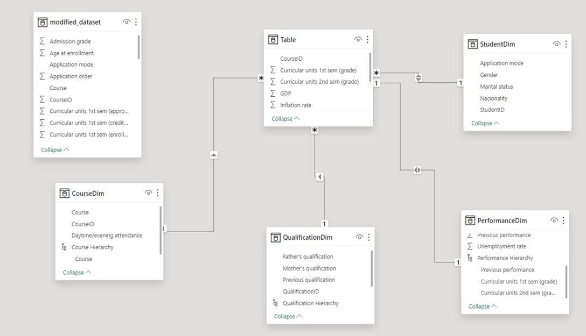

# STUDENTS PERFORMANCE ANALYSIS AND RETENTION USING OLAP Operations
## Problem Statement

High dropout rates and inconsistent academic performance issues in educational institution.
The need to identify at risk students early in their academic journey.

## Objectives

To identify at-risk students early in their academic journey.
To identify key factors affecting student retention.
To assess the impact of demographic and academic variables on student success.
To provide actionable insights for improving student retention rates.

## Dataset Link- https://archive.ics.uci.edu/dataset/697/predict+students+dropout+and+academic+success
## Multi-Dimensional Model

# The detailed PowerBI Project is attatched below:
